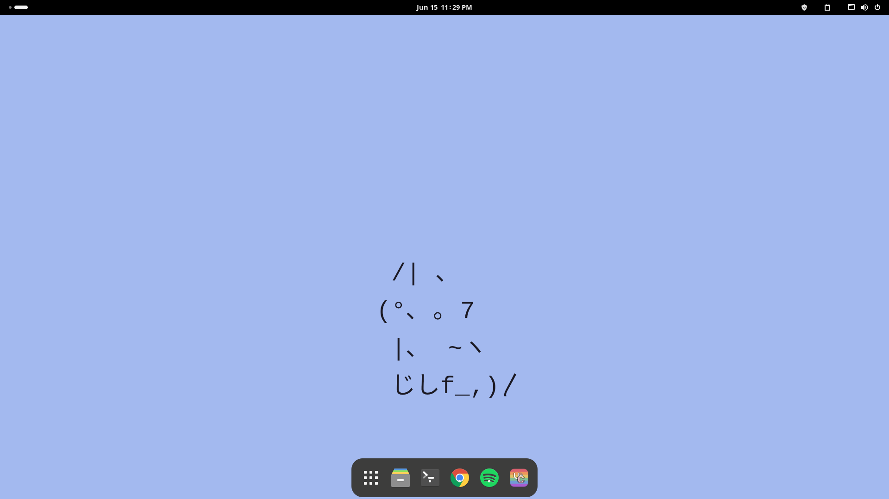

# My .files

## 🛠 Development tools

Currently I'm using Manjaro as my dev OS.

- **Terminal**: [wezterm](https://wezfurlong.org/wezterm/)
- **Shell**: [fish](https://fishshell.com/)
- **Prompt styles** and **colors**: [starship](https://starship.rs/), [config](wsl/.config/starship.toml)
- **Terminal workspace**: [zellij](https://zellij.dev/), catppuccin mocha theme
- **Code editor**: [visual studio code](https://code.visualstudio.com/) + [lunar vim](https://www.lunarvim.org/)

## 🦄 Gallery

Most of these wallpapers I stole from the [gboncoffee wallpapers repository](https://github.com/gboncoffee/wallpapers).

